<p align="center">
  
  
  
</p>

<h1>🩺 Doctor Appointment Booking App</h1>

<p>
A modern, cross-platform <b>Doctor Appointment Booking App</b> built with <b>Flutter</b> and <b>Firebase</b>, letting patients discover doctors, check <b>available time slots</b>, and book appointments — while giving doctors a dedicated dashboard to manage their schedule.
</p>

---

## 📑 Table of Contents

* [Overview](#-overview)
* [Features](#-features)
* [Tech Stack](#️-tech-stack)
* [Project Architecture](#️-project-architecture)
* [Firebase](#-firebase)
* [Getting Started](#-getting-started)
* [Screenshots](#-screenshots)
* [Team Members & Contributions](#-team-members--contributions)
* [Project Information](#-project-information)

---

## 📖 Overview

The Doctor Appointment Booking App streamlines finding a doctor and scheduling a visit. Patients can search and filter doctors by specialty, view profiles and available time slots, and book, track, or cancel appointments — all from one place. Doctors get a dedicated dashboard to review incoming bookings, manage their slots, and mark appointments as complete or cancelled.

The app follows **Clean Architecture** principles with a clear separation between data, business logic, and presentation, making it scalable, testable, and easy to maintain.

---

## ✨ Features

### 👤 Patient

* Registration & Login
* Browse, search and filter doctors
* View doctor details and availability
* Book appointments
* View and cancel appointments
* Manage profile
* Notifications

### 🩺 Doctor

* Doctor Login
* Doctor Dashboard
* View and manage appointments
* Complete or cancel appointments
* Manage patient appointment slots

---

## 🛠️ Tech Stack

| Category         | Technology                              |
| ---------------- | --------------------------------------- |
| Framework        | Flutter & Dart                          |
| Authentication   | Firebase Authentication                 |
| Database         | Cloud Firestore                         |
| State Management | BLoC / Cubit                            |
| Routing          | GoRouter                                |
| Architecture     | Clean Architecture + Repository Pattern |

---

## 🏗️ Project Architecture

```text
lib/
├── core/           → Routes, theme & constants
├── data/           → Models & repositories
└── presentation/   → Screens & state management

test/               → Automated tests
firestore.rules     → Firestore security rules
firebase.json       → Firebase configuration
```

The **repository pattern** decouples the presentation layer from data sources, allowing the app to work with mock data during development and connect to Firebase for live application data.

---

## 🔥 Firebase

The app uses **Firebase Authentication** for sign-up/sign-in and **Cloud Firestore** for storing user profiles, doctors, appointments, and slot availability.

### Firestore Collections

```text
users/
doctors/
specialties/
appointments/
doctorSlots/
```

Firestore security rules enforce role-based, user-specific access so patients and doctors can only read and write the data they're authorized to.

---

## 🚀 Getting Started

### Prerequisites

* [Flutter SDK](https://docs.flutter.dev/get-started/install) (stable channel)
* A [Firebase](https://firebase.google.com/) project with Authentication and Firestore enabled

### Installation

```bash
# Clone the repository
git clone https://github.com/onkarlokhande123-cpu/doctor-appointment-booking-app.git
cd doctor-appointment-booking-app

# Install dependencies
flutter pub get

# Run the app
flutter run
```

> **Note:** Firebase configuration files are required to run the application with Firebase.

---

## 📸 Screenshots

### 🔐 Authentication

| Login                           | Register                              |
| ------------------------------- | ------------------------------------- |
| 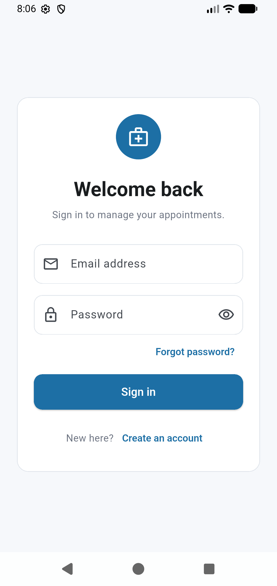 | 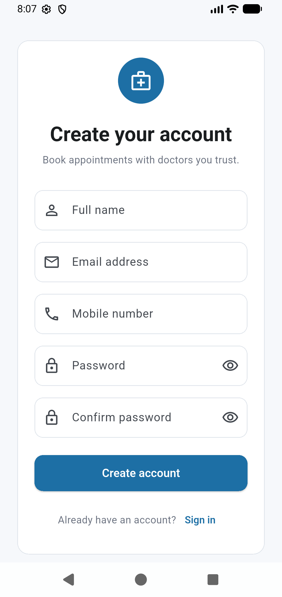 |

### 🏠 Patient

| Home                          | Doctor Details                                    |
| ----------------------------- | ------------------------------------------------- |
| 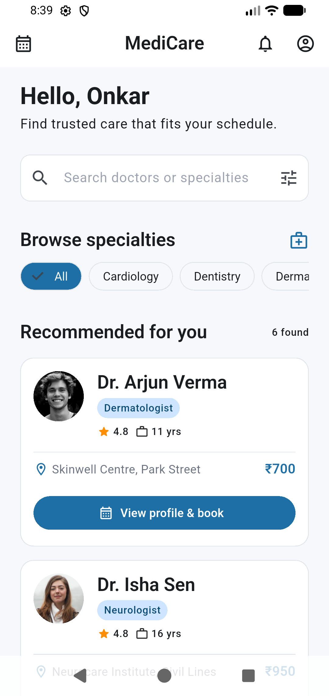 | 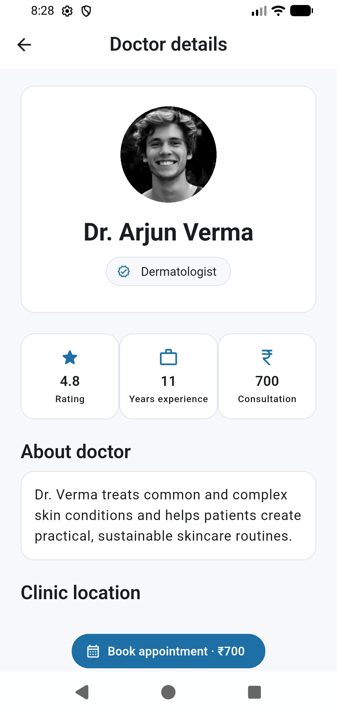 |

### 📅 Booking

| Date & Slot                               | Patient Details                                     |
| ----------------------------------------- | --------------------------------------------------- |
| 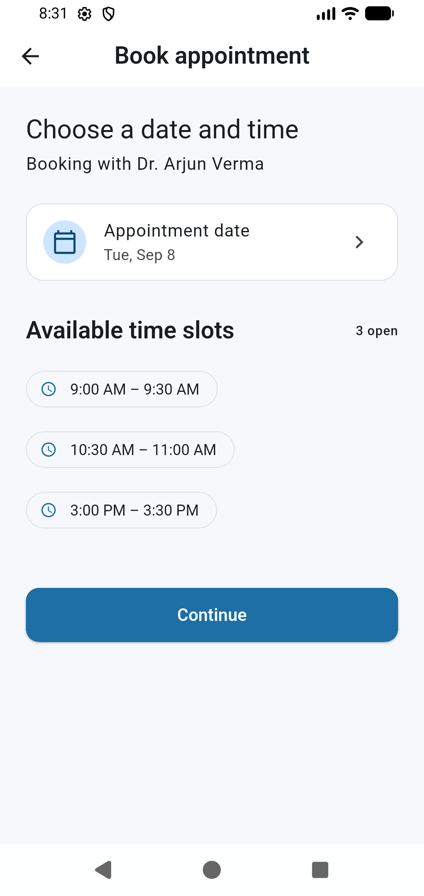 | 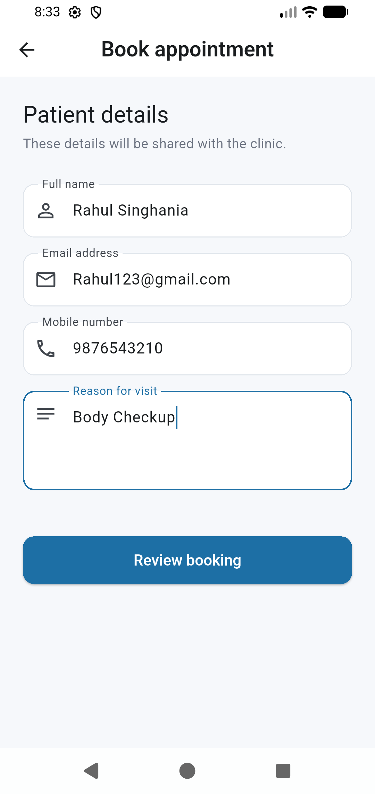 |

| Booking Summary                                     | Booking Success                                     |
| --------------------------------------------------- | --------------------------------------------------- |
| 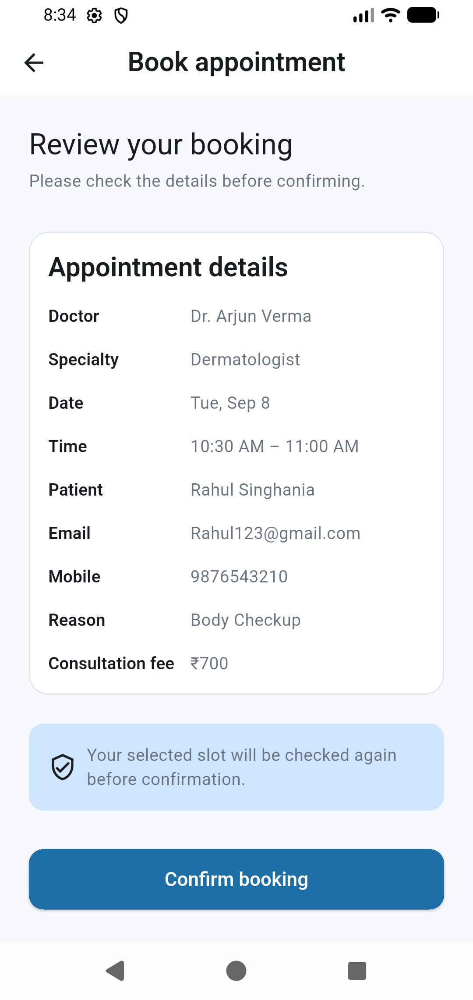 | 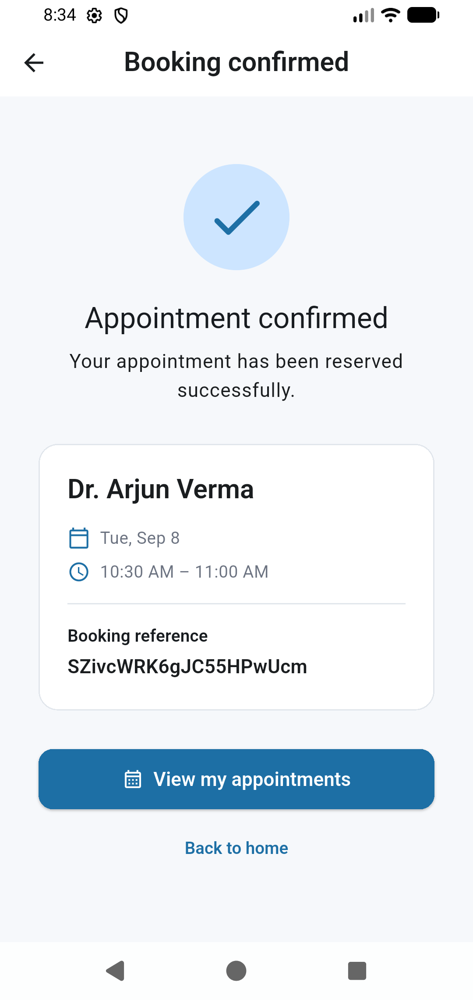 |

### 📋 Appointments

| My Appointments                               | Profile                             |
| --------------------------------------------- | ----------------------------------- |
| 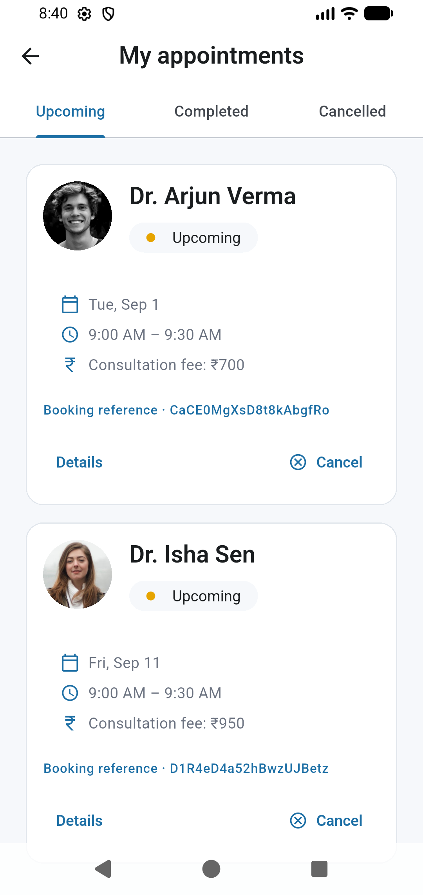 | 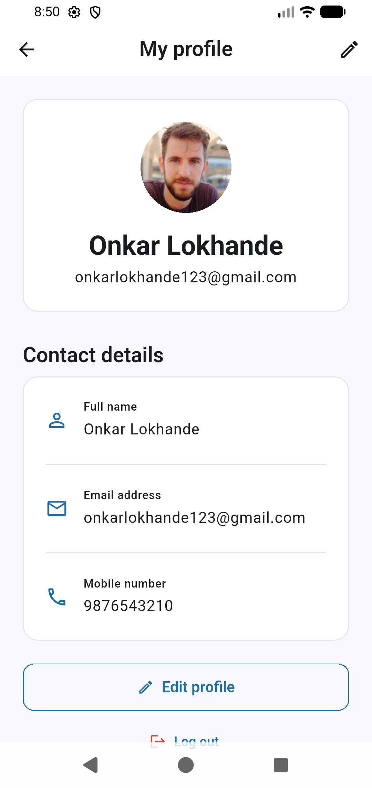 |

### 🩺 Doctor

| Doctor Dashboard                                      | Doctor Appointments                                         |
| ----------------------------------------------------- | ----------------------------------------------------------- |
| 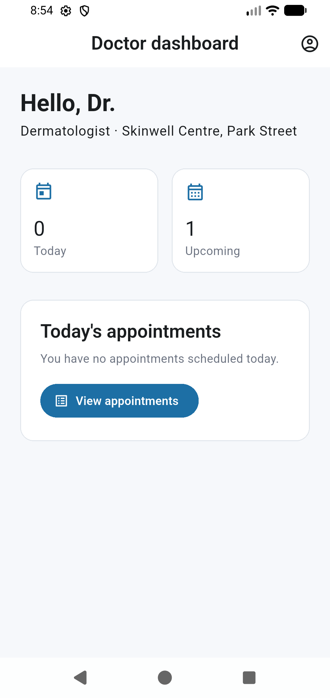 | 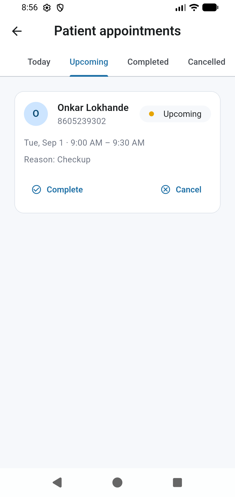 |

---

## 👥 Team Members & Contributions

This project was developed collaboratively by a team of 10 members.

| No. | Team Member            | Contribution                                            |
| --: | ---------------------- | ------------------------------------------------------- |
|   1 | **Onkar Lokhande**     | **Project Development, Flutter Integration & Firebase** |
|   2 | **Aryan Mohite**       | UI Development & Home Screen                            |
|   3 | **Sahil Kolpe**        | Authentication & User Management                        |
|   4 | **Darshan Mhaise**     | Doctor Module & Doctor Details                          |
|   5 | **Prasad Lodhe**       | Appointment Booking & Slot Management                   |
|   6 | **Chaitanya Matsagar** | Doctor Dashboard & Appointment Management               |
|   7 | **Krushna Matsagar**   | Firestore Database & Security Rules                     |
|   8 | **Mohit Jagtap**       | State Management using BLoC/Cubit                       |
|   9 | **Onkar Nikam**        | Testing, Bug Fixing & Validation                        |
|  10 | **Sushant Nalawade**   | Documentation, UI Testing & Project Presentation        |

---

## 🎓 Project Information

|                        |                                |
|------------------------|--------------------------------|
| **Project**            | Doctor Appointment Booking App |
| **Platform**           | Flutter                        |
| **Backend**            | Firebase                       |
| **Database**           | Cloud Firestore                |
| **Internship Company** | Thought Bliss Solutions        |

Developed as an internship project at **Thought Bliss Solutions**.

---

<p align="center">Made with ❤️ using Flutter & Firebase</p>
